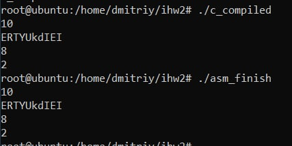
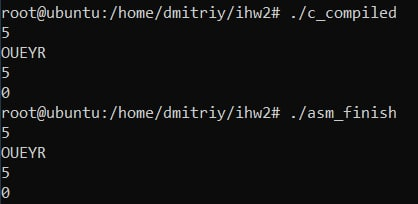
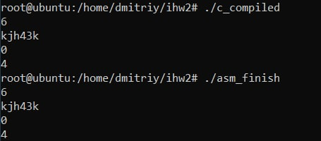
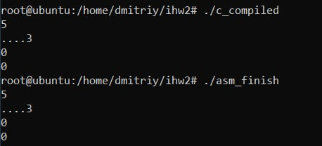

## Файлы
- `main.c` - базовая программа на С
- `c_compiled` - базовая программа на C, откомпилированная без модификации ассемблерного кода
- `asm.s` - базовая программа на C скомпилированная до уровня ассемблерных команд, которая была откомпилирована с флагами: `-O0 -Wall -masm=intel -S -fno-asynchronous-unwind-tables -fcf-protection=none`, а также модифицирована вручную и дополнена комментариями
- `asm_finish` - запускаемый файл модифицированной программы, скомпилированный без использования опций отладки

## Тестовое покрытие
#### Тесты выполняют функцию проверки корректности работы программы на корректных входных данных. Обусловим формат входных данных :
- Размер подаваемой на вход строки – натуральное число, не превосходящее 1000.
- Кол-во вводимых символов совпадает с первым параметром.
- Вводимые символы отвечают условию задачи.

### Тест 1
#### Входные данные
```text
10
ERTYUkdIEI
```
#### Ожидаемые выходные данные
```text
8
2
```
 
### Тест 2
#### Входные данные
```text
5
OUEYR
```
#### Ожидаемые выходные данные
```text
5
0
```

### Тест 3
#### Входные данные
```text
6
kjh43k
```
#### Ожидаемые выходные данные
```text
0
4
```

### Тест 4
#### Входные данные
```text
5
....3
```
#### Ожидаемые выходные данные
```text
0
0
```
 